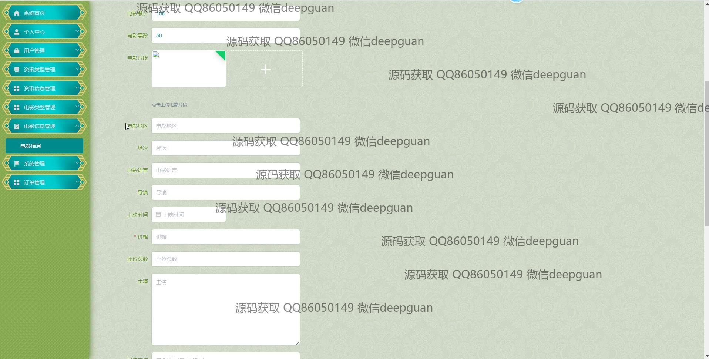

<h1 align="center">基于框架的电影订票系统</h1>

## 简介
基于Spring Boot框架的电影订票系统，角色分为管理员和用户；具有电影信息管理、订单管理、用户信息管理、评论和选座功能。界面设计简洁，强调用户体验，提供多语言、多维度数据显示与分析。    --计算机毕业设计源码；毕设源码；java毕业设计源码

## 联系方式

<h3 align="center">获取完整代码与数据库文件 + 微信：deepguan QQ: 86050149 QQ群: 783742310</h3>

<h3 align="center">可帮忙远程部署 包运行成功！提供远程部署、修改代码、设计文档指导、代码讲解等服务！</h3>

## 功能介绍（完整见运行截图）
管理员： 基本功能包括登录、注册、退出，系统首页提供导航菜单，轮播图管理，电影资讯和订单管理等功能模块支持动态管理和更新。管理员还能发布、编辑电影信息，管理电影分类及其详细信息。订单管理界面提供订单查询、统计及处理功能，如退款和销售数据可视化等，协助管理员高效管理电影票务。  
用户： 基本功能包括登录、注册、退出，主界面提供电影浏览和分类筛选功能。用户可查看电影详细信息、预告片和用户评论，进行订票和管理个人信息、历史订单等。订票模块支持场次、座位选择及在线购票，提供订单状态和退款处理功能，用户信息管理界面允许个人信息更新和余额充值，提升用户互动体验和便捷性。

## 运行截图

本代码来源于网络,仅供学习参考使用!

